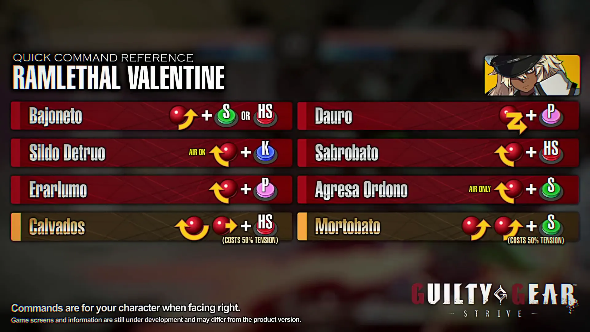

OKfdshgd



## Combo

---

WB = Wall Break

W = 牆

**エラル 214p ダウロ 623p**

- 開幕
    - FS > H

### 特殊技派生

- 6P > 214P
    
    P > 6P
    
    K > 6P
    
    2K > 6P
    
- 6H、2H擇
    
    P > 6H 可防
    
    K > 6H 可防
    
    S > 6H
    
    - **S > 6H > 623P > K > 6H > 236H > W > 214H > WB**
        
        ```
          **\\ 2H > 623P > K > 6H > 236H > W > 214H > WB**
        ```
        
    - **S > 2H > 623P > S > 2H > 236S > 爆 > 236H > WB**
        
        ```
          **\\ 2H > 623P > K > 6H > 236H > W > 214H > WB**
        
          \\ 2H > 623P > CS > 6H > 236H > 632146H > WB
        
          \\ 2H > 623P > CS > 6H > 214K > S > 6H > 214H
        ```
        
    - CS > FS >
        
        - CS > FS > H > 236H > > 236S > 632146H
        - 角落 CS > FS > 236 H > S > 2H > 623P > 214P > WB
    - 6H
        
        6H > 623P > CS > 2H > 236H > 236S > 632146H > WB
        
        6H > 214K > S > 2H >214K >S > H >632146H
        

### 通常技起始

- (K) **2D >623P 派生**
    
    - **K> 2D > 623P > K > 214P > K > 214P x3 (最大化)**
        
    - **K> 2D > 623P > K > 6H > 236H > 爆 > 236S ＼ 214H**
        
    - K> 2D > 623P > K > 214P x3
        
        ```
          　　　　　    \\ 2K > 214P x3
        ```
        
    - K >2D > 623P > K > 6H> 236H > 236S > 632146H > WB \ 6H >
        
    - (待測) K> 2D > 623P > S > 2H > 236H > 236S > 632146H > WB
        
- 2K > 2D
    
    - 2K > 2D > 623P > 2K (K不可) > 214P x3
    - 2K > 2D > 214P x3
- 6P > 214P x3
    
    - P or 2P > 6P >214P x3
    - 2K 待測 K or 2K> 6P > 214Px3
    
- RC技
    
    - 214HS > RC > 214HS > RC >214H ※
    - 236236S > 66RC > CS >2H > 236S >66 > CS > 2HS> 214P > 214H [RISC 100%]
    - 摔 > RC
    - 空中投 > RRC > 落地 > S > 2H > 236S > D > WB
    - RC > S > 2H
    - RC > S > 6H > 236H > 236S
    
- 對空
    
    - JK > 214S
    - JP x N > 214S
    - JP > K > 214S > CS > 6H > 236H >236S >214H (輕中)
    - JP > K > 2K > 6H > 236H >66 > CS >2H (重)
    - [https://www.youtube.com/watch?v=gBDTIrfAksA](https://www.youtube.com/watch?v=gBDTIrfAksA)
    
    ---
    
    ### Kazunoko
    
    - JK > JDC> JK > JD > Dash >立K > 214P x3 \ 6H > 236H >236S >WB
    
    ```
      [【Guilty Gear Strive】ラムレザルの実戦向けコンボ集 中距離戦から大ダメージを奪おう!!00.03.17.912_00.03.38.926.mp4](<https://s3-us-west-2.amazonaws.com/secure.notion-static.com/a1b4b9c4-0824-4297-bbfd-f59944571e40/%E3%80%90Guilty_Gear_Strive%E3%80%91%E3%83%A9%E3%83%A0%E3%83%AC%E3%82%B6%E3%83%AB%E3%81%AE%E5%AE%9F%E6%88%A6%E5%90%91%E3%81%91%E3%82%B3%E3%83%B3%E3%83%9C%E9%9B%86_%E4%B8%AD%E8%B7%9D%E9%9B%A2%E6%88%A6%E3%81%8B%E3%82%89%E5%A4%A7%E3%83%80%E3%83%A1%E3%83%BC%E3%82%B8%E3%82%92%E5%A5%AA%E3%81%8A%E3%81%86!!00.03.17.912_00.03.38.926.mp4>)
    ```
    
- Dust
    
    - HS>HS>K>HS>P>HS
    - 9持續 P >K > 9 > P > K > H > H (自開發)
    - 2

- Dash Cancel (DC)
    
    - 浮空 > 214P > 214P > DC > 214P >214P
    - 214P > DC >214K