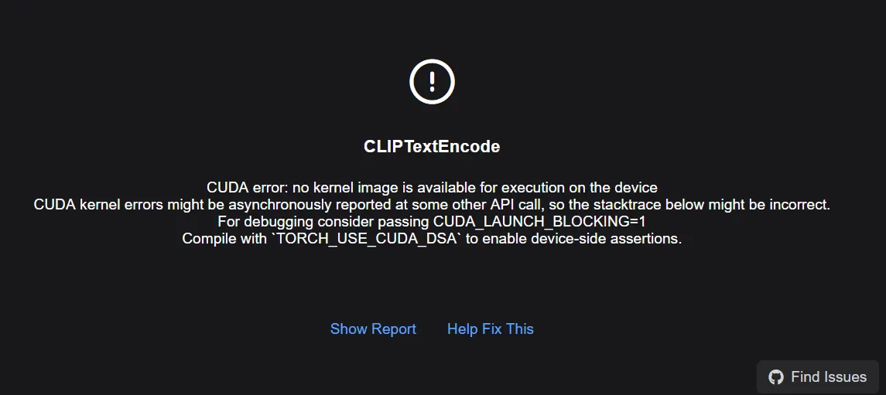

### 📝 [修正版] ComfyUI 環境升級錯誤修復紀錄 (2025-11-27)

- **事件**：ComfyUI 自動更新導致核心版本錯亂 (誤升級至不相容版本)。
- **目標**：解決 RTX 5070 Ti 核心與 SageAttention 等插件的版本衝突。
- **關鍵成功操作 (正確解法)**：
    1. **卸載錯誤核心**：Bash
        
        `.\python_embeded\python.exe -m pip uninstall torch torchvision torchaudio -y`
        
    2. **安裝正確版本 (2.8.0)**：
    *(直接指定回歸穩定的 2.8.0，讓原本的插件能繼續運作)*Bash
        
        `.\python_embeded\python.exe -m pip install torch==2.8.0 torchvision==0.23.0 torchaudio==2.8.0 --index-url https://download.pytorch.org/whl/cu128`
        
    3. **補回依賴** (如果被誤刪)：Bash
        
        `.\python_embeded\python.exe -m pip install torchsde`


🛠️ ComfyUI 環境維護手冊 (RTX 5070 Ti 穩定版)

最後更新： 2025-12-10
適用環境： ComfyUI Windows Portable (Python 3.13)
核心目標： 確保 RTX 5070 Ti 正常運作，同時維持與 SageAttention 2.2 及多數 Custom Nodes 的完美相容性。


## ⚠️ 核心邏輯 (道標)

- **禁止事項：** 切勿使用 `nightly` 或 `pre` 指令安裝 PyTorch 2.10+，這會導致 SageAttention 等依賴編譯檔 (.pyd/.dll) 的插件崩潰。
- **黃金組合：** **PyTorch 2.8.0 (Stable) + CUDA 12.8**。
- **驅動相容：** 系統顯卡驅動 (CUDA 12.9) 可完美向下相容運行此環境。

---

## 1. 標準重置/修復流程 (SOP)

如果環境報錯 (DLL load failed) 或核心損壞，請依序執行以下三步。

### 步驟一：清理戰場 (完全卸載)

> 清除所有可能衝突的核心庫與相關依賴，確保安裝環境純淨。
> 

```bash
.\\python_embeded\\python.exe -m pip uninstall -y sageattention torch torchvision torchaudio torchsde
```

### 步驟二：重建地基 (安裝穩定版核心)

> 關鍵指令： 強制指定版本 2.8.0 與索引 URL cu128。
> 

Bash

`.\python_embeded\python.exe -m pip install torch==2.8.0 torchvision==0.23.0 torchaudio==2.8.0 --index-url https://download.pytorch.org/whl/cu128`

### 步驟三：補回關鍵零件 (修復 torchsde 錯誤)

> PyTorch 官方包不含 torchsde，若不補裝會導致 ModuleNotFoundError: No module named 'torchsde'。
> 

Bash

`.\python_embeded\python.exe -m pip install torchsde`

---

## 🔍 保險絲檢查 (版本驗證)

> 執行完上述步驟後，務必執行此指令確認地基是否穩固。
> 

**檢測指令：**

Bash

`.\python_embeded\python.exe -m pip list | findstr "torch"`

**✅ 合格標準 (必須完全符合)：**

- `torch` -> **2.8.0+cu128** (不能是 2.10 或 dev)
- `torchvision` -> **0.23.0+cu128**
- `torchaudio` -> **2.8.0+cu128**

---

# ⚡ SageAttention 2.2 安裝與註冊筆記 

> 注意： 由於 Portable 版缺少 Python.h 開發標頭檔，無法直接透過 pip install 線上編譯。必須使用預先編譯好的 Wheel (.whl) 檔案。
> 

## 1. 前置準備

- **確認核心：** 必須先完成上方的「環境維護手冊」流程，確認 PyTorch 版本為 **2.8.0**。
- **準備檔案：** 確認您的資料夾 `T:\AI\ComfyUI_windows_portable\` 內有此檔案：
    - 檔案名稱：`sageattention-2.2.0+cu128torch2.8.0-cp313-cp313-win_amd64.whl`
    - *(檔名解讀：支援 CUDA 12.8 + PyTorch 2.8.0 + Python 3.13)*

## 2. 安裝指令 (手動掛載渦輪)

請開啟黑色 CMD視窗，執行以下指令：

Bash

`.\python_embeded\python.exe -m pip install "sageattention-2.2.0+cu128torch2.8.0-cp313-cp313-win_amd64.whl"`

## 3. 最終驗收 (啟動確認)

執行以下指令，檢查是否成功「聯姻」：

Bash

`.\python_embeded\python.exe -m pip list | findstr "sageattention"`

**✅ 成功訊號：**

- 顯示：`sageattention 2.2.0+cu128torch2.8.0`
- *(重點檢查：後面的 `torch2.8.0` 必須與您安裝的 torch 版本一致)*

---

